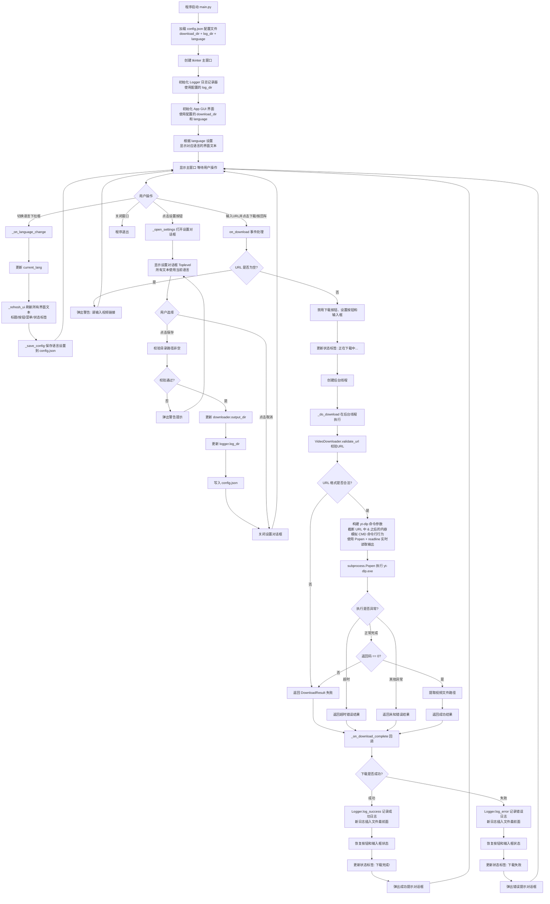
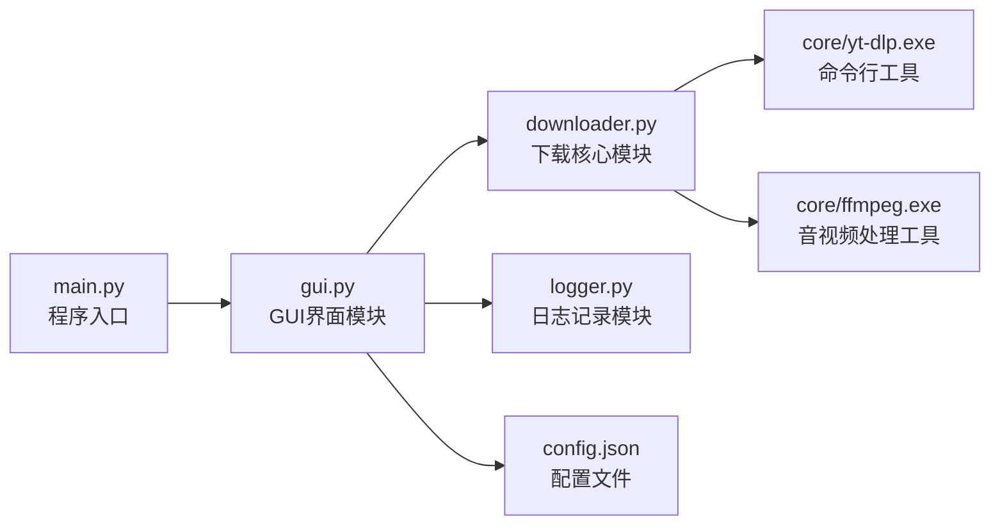
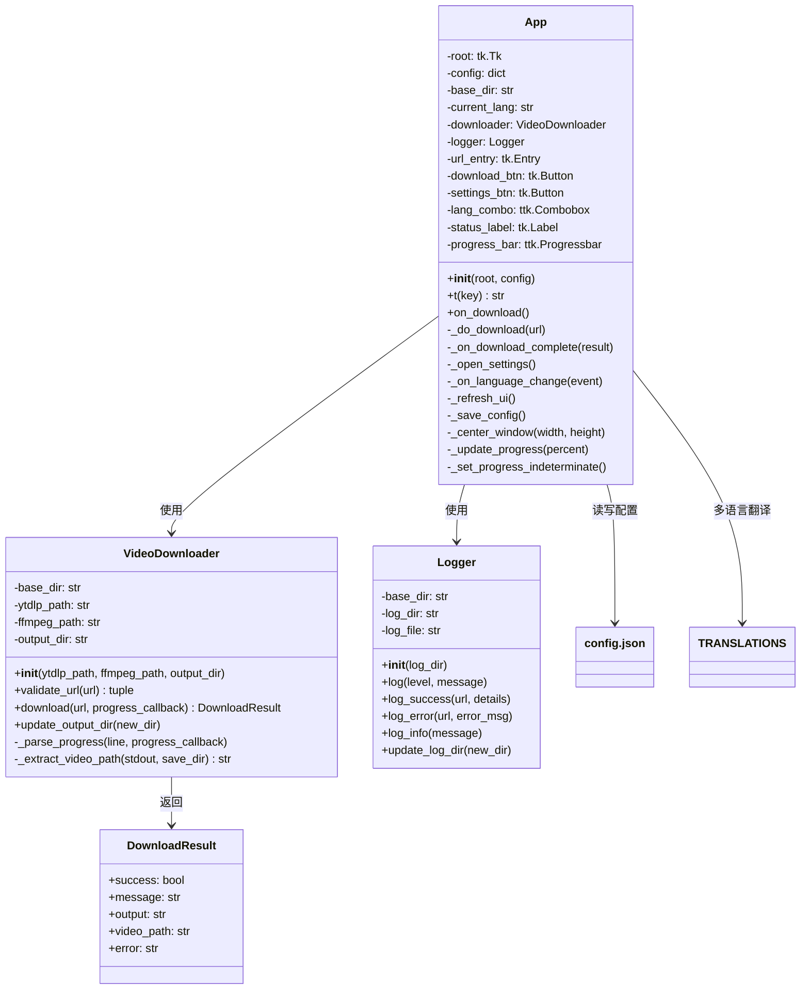
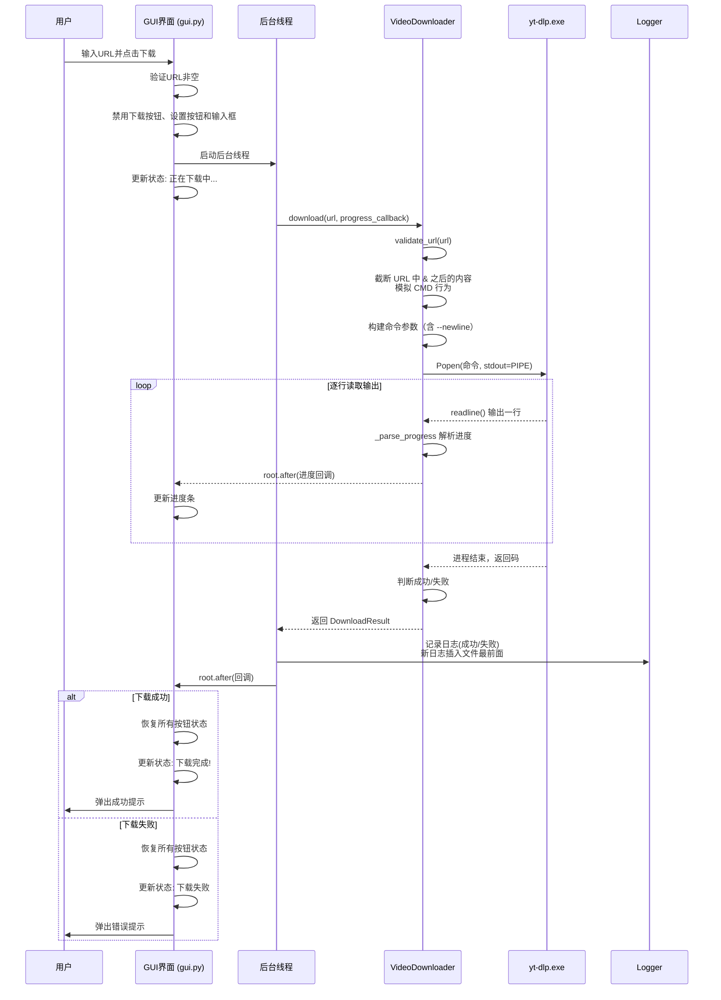
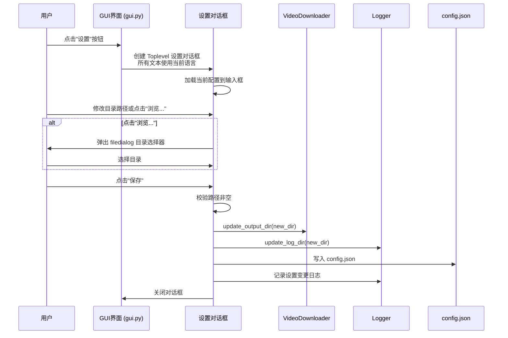
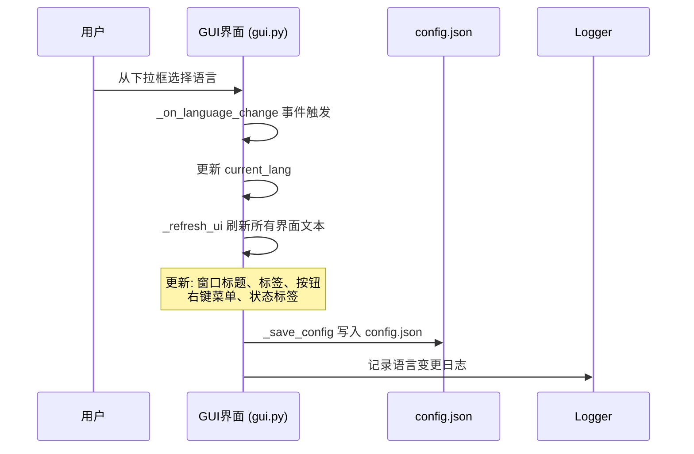

# yt-dlp GUI 视频下载器 — 程序设计流程图

## 程序整体执行流程

```mermaid
flowchart TD
    A[程序启动 main.py] --> B[加载 config.json 配置文件<br/>download_dir + log_dir + language]
    B --> C[创建 tkinter 主窗口]
    C --> D[初始化 Logger 日志记录器<br/>使用配置的 log_dir]
    D --> E[初始化 App GUI 界面<br/>使用配置的 download_dir 和 language]
    E --> F[根据 language 设置<br/>显示对应语言的界面文本]
    F --> G[显示主窗口 等待用户操作]
    G --> H{用户操作}
    H -->|输入URL并点击下载/按回车| I[on_download 事件处理]
    H -->|点击设置按钮| J[_open_settings 打开设置对话框]
    H -->|切换语言下拉框| K[_on_language_change]
    H -->|关闭窗口| Z[程序退出]

    K --> K2[更新 current_lang]
    K2 --> K3[_refresh_ui 刷新所有界面文本<br/>标题/按钮/菜单/状态标签]
    K3 --> K4[_save_config 保存语言设置到 config.json]
    K4 --> G

    J --> J2[显示设置对话框 Toplevel<br/>所有文本使用当前语言]
    J2 --> J3{用户选择}
    J3 -->|点击保存| L[校验目录路径非空]
    L --> M{校验通过?}
    M -->|否| N[弹出警告提示]
    N --> J2
    M -->|是| O[更新 downloader.output_dir]
    O --> P[更新 logger.log_dir]
    P --> Q[写入 config.json]
    Q --> R[关闭设置对话框]
    R --> G
    J3 -->|点击取消| R

    I --> S{URL 是否为空?}
    S -->|是| T[弹出警告: 请输入视频链接]
    T --> G
    S -->|否| U[禁用下载按钮、设置按钮和输入框]
    U --> V[更新状态标签: 正在下载中...]
    V --> W[创建后台线程]
    W --> X[_do_download 在后台线程执行]

    X --> Y[VideoDownloader.validate_url 校验URL]
    Y --> Z2{URL 格式是否合法?}
    Z2 -->|否| AA[返回 DownloadResult 失败]
    Z2 -->|是| AB[构建 yt-dlp 命令参数<br/>截断 URL 中 & 之后的内容<br/>模拟 CMD 命令行行为<br/>使用 Popen + readline 实时读取输出]
    AB --> AC[subprocess.Popen 执行 yt-dlp.exe]

    AC --> AD{执行是否异常?}
    AD -->|超时| AE[返回超时错误结果]
    AD -->|其他异常| AF[返回未知错误结果]
    AD -->|正常完成| AG{返回码 == 0?}

    AG -->|是| AH[提取视频文件路径]
    AH --> AI[返回成功结果]
    AG -->|否| AA

    AA --> AJ[_on_download_complete 回调]
    AE --> AJ
    AF --> AJ
    AI --> AJ

    AJ --> AK{下载是否成功?}
    AK -->|成功| AL[Logger.log_success 记录成功日志<br/>新日志插入文件最前面]
    AL --> AM[恢复按钮和输入框状态]
    AM --> AN[更新状态标签: 下载完成!]
    AN --> AO[弹出成功提示对话框]
    AO --> G

    AK -->|失败| AP[Logger.log_error 记录错误日志<br/>新日志插入文件最前面]
    AP --> AQ[恢复按钮和输入框状态]
    AQ --> AR[更新状态标签: 下载失败]
    AR --> AS[弹出错误提示对话框]
    AS --> G
```

## 模块调用关系

```mermaid
graph LR
    A[main.py<br/>程序入口] --> B[gui.py<br/>GUI界面模块]
    B --> C[downloader.py<br/>下载核心模块]
    B --> D[logger.py<br/>日志记录模块]
    B --> E[config.json<br/>配置文件]
    C --> F[core/yt-dlp.exe<br/>命令行工具]
    C --> G[core/ffmpeg.exe<br/>音视频处理工具]
```

## 类结构关系

```mermaid
classDiagram
    class App {
        -root: tk.Tk
        -config: dict
        -base_dir: str
        -current_lang: str
        -downloader: VideoDownloader
        -logger: Logger
        -url_entry: tk.Entry
        -download_btn: tk.Button
        -settings_btn: tk.Button
        -lang_combo: ttk.Combobox
        -status_label: tk.Label
        -progress_bar: ttk.Progressbar
        +__init__(root, config)
        +t(key) str
        +on_download()
        -_do_download(url)
        -_on_download_complete(result)
        -_open_settings()
        -_on_language_change(event)
        -_refresh_ui()
        -_save_config()
        -_center_window(width, height)
        -_update_progress(percent)
        -_set_progress_indeterminate()
    }

    class VideoDownloader {
        -base_dir: str
        -ytdlp_path: str
        -ffmpeg_path: str
        -output_dir: str
        +__init__(ytdlp_path, ffmpeg_path, output_dir)
        +validate_url(url) tuple
        +download(url, progress_callback) DownloadResult
        +update_output_dir(new_dir)
        -_parse_progress(line, progress_callback)
        -_extract_video_path(stdout, save_dir) str
    }

    class DownloadResult {
        +success: bool
        +message: str
        +output: str
        +video_path: str
        +error: str
    }

    class Logger {
        -base_dir: str
        -log_dir: str
        -log_file: str
        +__init__(log_dir)
        +log(level, message)
        +log_success(url, details)
        +log_error(url, error_msg)
        +log_info(message)
        +update_log_dir(new_dir)
    }

    App --> VideoDownloader : 使用
    App --> Logger : 使用
    App --> config.json : 读写配置
    App --> TRANSLATIONS : 多语言翻译
    VideoDownloader --> DownloadResult : 返回
```

## 下载流程详细步骤

```mermaid
sequenceDiagram
    participant User as 用户
    participant GUI as GUI界面 (gui.py)
    participant Thread as 后台线程
    participant DL as VideoDownloader
    participant YTDLP as yt-dlp.exe
    participant Log as Logger

    User->>GUI: 输入URL并点击下载
    GUI->>GUI: 验证URL非空
    GUI->>GUI: 禁用下载按钮、设置按钮和输入框
    GUI->>Thread: 启动后台线程
    GUI->>GUI: 更新状态: 正在下载中...

    Thread->>DL: download(url, progress_callback)
    DL->>DL: validate_url(url)
    DL->>DL: 截断 URL 中 & 之后的内容<br/>模拟 CMD 行为
    DL->>DL: 构建命令参数（含 --newline）
    DL->>YTDLP: Popen(命令, stdout=PIPE)
    
    loop 逐行读取输出
        YTDLP-->>DL: readline() 输出一行
        DL->>DL: _parse_progress 解析进度
        DL-->>GUI: root.after(进度回调)
        GUI->>GUI: 更新进度条
    end
    
    YTDLP-->>DL: 进程结束，返回码
    DL->>DL: 判断成功/失败
    DL-->>Thread: 返回 DownloadResult

    Thread->>Log: 记录日志(成功/失败)<br/>新日志插入文件最前面
    Thread->>GUI: root.after(回调)

    alt 下载成功
        GUI->>GUI: 恢复所有按钮状态
        GUI->>GUI: 更新状态: 下载完成!
        GUI->>User: 弹出成功提示
    else 下载失败
        GUI->>GUI: 恢复所有按钮状态
        GUI->>GUI: 更新状态: 下载失败
        GUI->>User: 弹出错误提示
    end
```

## 设置流程

```mermaid
sequenceDiagram
    participant User as 用户
    participant GUI as GUI界面 (gui.py)
    participant SettingsWin as 设置对话框
    participant DL as VideoDownloader
    participant Log as Logger
    participant Config as config.json

    User->>GUI: 点击"设置"按钮
    GUI->>SettingsWin: 创建 Toplevel 设置对话框<br/>所有文本使用当前语言
    SettingsWin->>SettingsWin: 加载当前配置到输入框
    
    User->>SettingsWin: 修改目录路径或点击"浏览..."
    
    alt 点击"浏览..."
        SettingsWin->>User: 弹出 filedialog 目录选择器
        User->>SettingsWin: 选择目录
    end
    
    User->>SettingsWin: 点击"保存"
    SettingsWin->>SettingsWin: 校验路径非空
    SettingsWin->>DL: update_output_dir(new_dir)
    SettingsWin->>Log: update_log_dir(new_dir)
    SettingsWin->>Config: 写入 config.json
    SettingsWin->>Log: 记录设置变更日志
    SettingsWin->>GUI: 关闭对话框
```

## 语言切换流程

```mermaid
sequenceDiagram
    participant User as 用户
    participant GUI as GUI界面 (gui.py)
    participant Config as config.json
    participant Log as Logger

    User->>GUI: 从下拉框选择语言
    GUI->>GUI: _on_language_change 事件触发
    GUI->>GUI: 更新 current_lang
    GUI->>GUI: _refresh_ui 刷新所有界面文本
    Note over GUI: 更新: 窗口标题、标签、按钮<br/>右键菜单、状态标签
    GUI->>Config: _save_config 写入 config.json
    GUI->>Log: 记录语言变更日志
```
