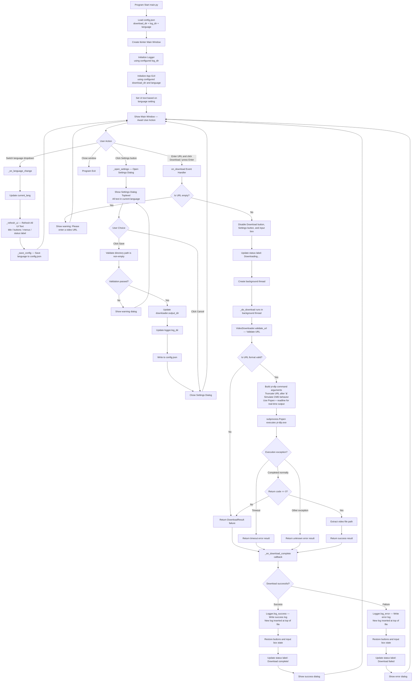
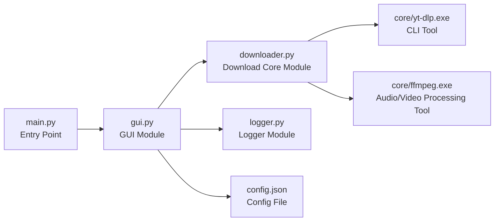
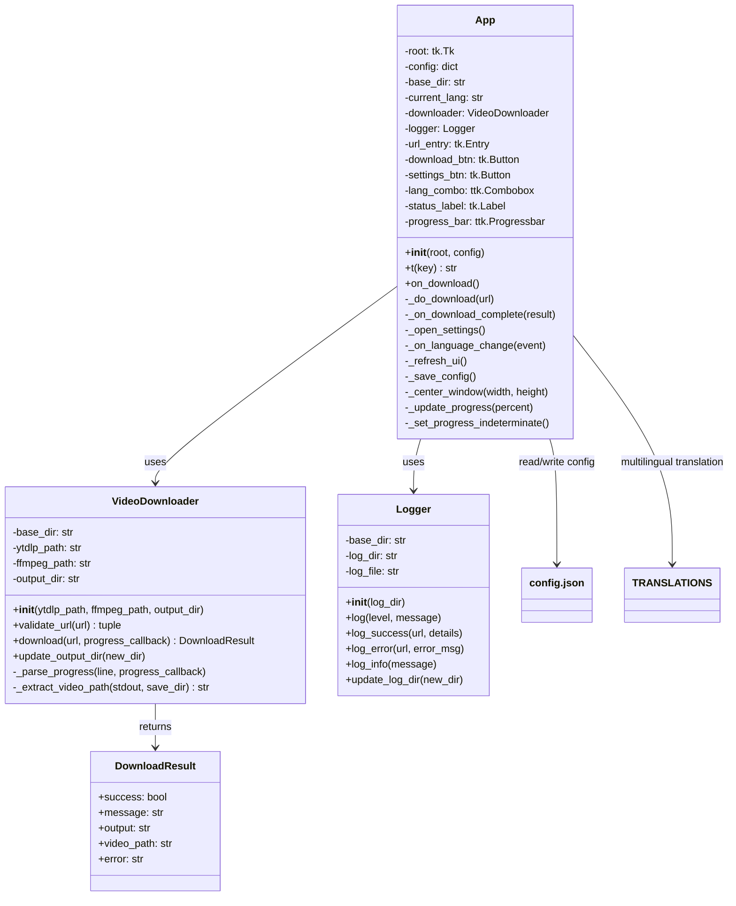
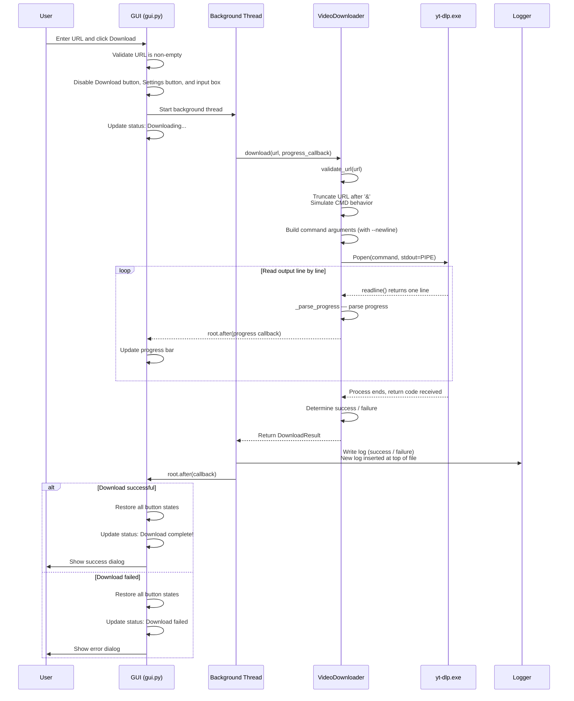
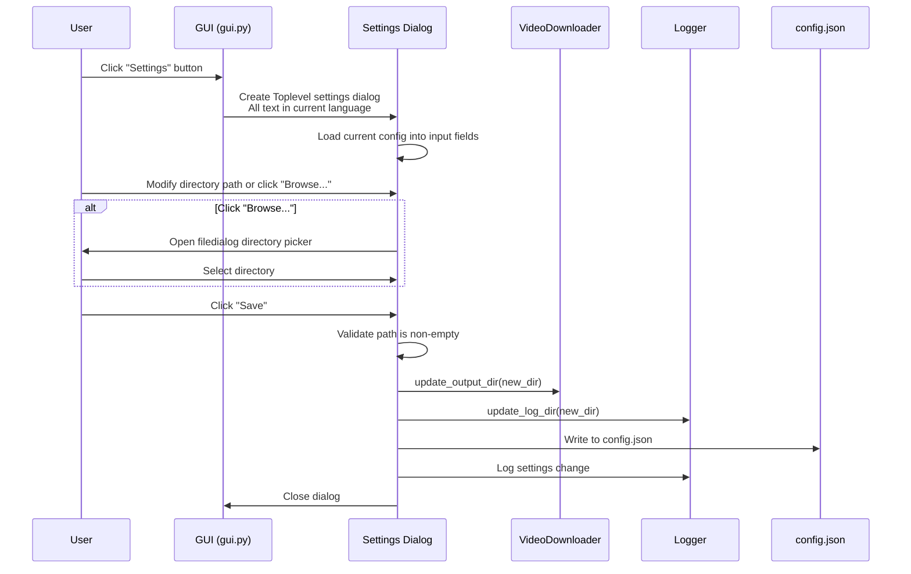
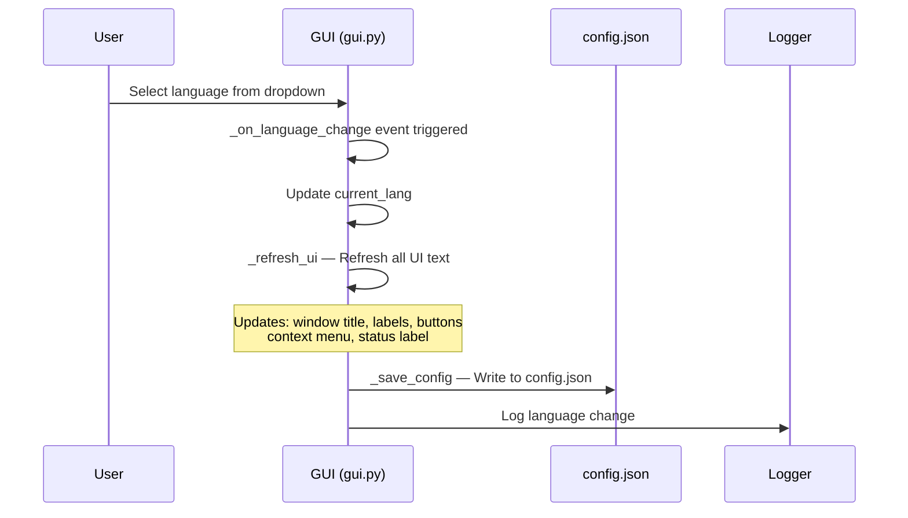

# yt-dlp GUI Video Downloader — Program Design Flowcharts

## Overall Program Execution Flow

## Module Call Relationships

## Class Structure

## Download Flow — Detailed Sequence

## Settings Flow

## Language Switch Flow

